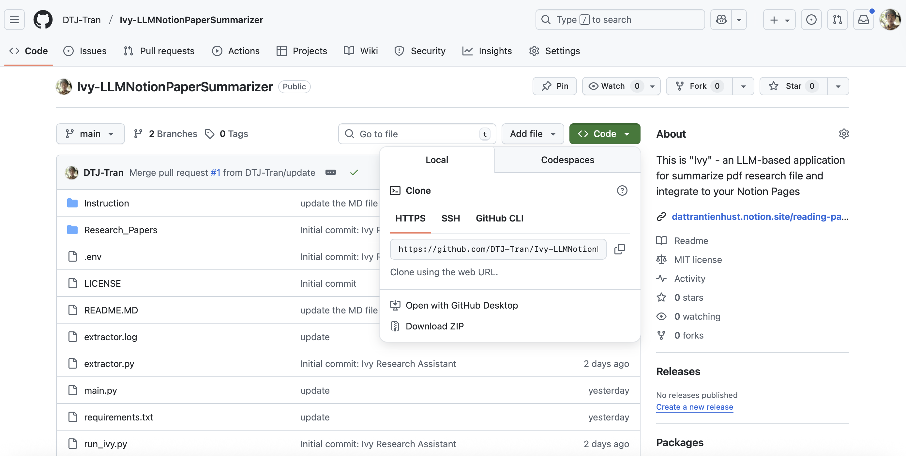

# 🌸 Ivy Research Assistant — Simplified Setup Guide

Your personal **AI-powered paper summarizer** that syncs beautifully with **Notion** 🧠✨  
Just drop your research PDFs — Ivy will read, summarize, and organize them automatically.

---

## 🪴 Pre-Requisites

You’ll need:
- A **Notion** account.
- An IDE (e.g., **VS Code**) or terminal to run Python.
- **Python ≥ 3.9** installed.

---

## 🩵 Step 1. Download & Unzip

Download the `Ivy` package as zip or clone it from GitHub:
```bash
git clone https://github.com/DTJ-Tran/Ivy-LLMNotionPaperSummarizer.git

```

---

## 📘 Step 2. Duplicate the Notion Template

Open this link:  
👉 [**Reading Paper Summarizing Tool Template**](https://dattrantienhust.notion.site/reading-paper-summarizing-tool)

Click “Duplicate” in the top-right corner to add it to your workspace.
Ivy will automatically connect to your Notion when you run it — no `NOTION_API_KEY` setup needed by yourself 🎉 - But you shall have to get the `NOTION_DATABASE_ID`
!

Note: **You don't have to duplicate the page - but the key is your database shall share the similar schema as the ones provided in the template**


- Make sure you copy the link from the original database page, not from a “Linked Database View” (the ones you create via `“Linked Database View”`).
- Linked views have their own block ID — these will not work with Ivy as the targeted DB and cause a 404 error:


### Get the `NOTION_DATABASE_ID`

1. Open your duplicated Notion database.  
2. Copy the full link (it looks like `https://www.notion.so/username/...<database_id>?v=...`) by follow the below interaction 

3. The **long string** before `?v=` is your **Database ID**.  
   Example:  
   ```
   28bf910aea75801e8490d58e80bb8a32
   ```

---

## 🔥 Step 3. Get Your Fireworks API Key
	1.	Go to https://fireworks.ai
	2.	Log in (free signup available)
	3.	Copy your API Key — this will be your FIREWORK_API_KEY

💡 Notes:
	•	New users get $1 of free compute credit.
	•	Ivy uses gpt-oss-20b by default.
	•	You can change the model anytime at https://app.fireworks.ai/models, but it’s optional.


---

## ⚙️ Step 4. Configure the .env File

Open .env in the Ivy folder and fill in:
```
NOTION_API_KEY=leave_empty_if_you_don't_have
NOTION_DATABASE_ID=fill_the_database_id
FIREWORK_API_KEY=your_fireworks_api_key
MODEL_NAME=accounts/fireworks/models/gpt-oss-20b
FOLDER_NAME="./Research_Papers"
MARKITDOWN_URL=http://localhost:6000/extract

```

🪶 You don’t need to touch the NOTION_API settings — Ivy handles connection automatically the first time you run it.

---

## 💥 Step 5. Run Ivy

Simply run:

```
python run_ivy.py
```

During the first run:
- 	Ivy will guide you to connect with your Notion workspace (via secure OAuth flow).

- 	Once connected, the token is stored locally — future runs are automatic.

- 	You’ll see a friendly console message like:

✅ Token verified — connected to workspace: [Your Notion Workspace Name]


---

✨ That’s It!

Now drop any .pdf into your ./Research_Papers folder, and Ivy will:
-	Extract the content 🧾
-	Summarize it into concise academic fields 🧠
-	Push the results directly to your Notion database 📘

---

Enjoy your AI-enhanced research workflow with Ivy 🌸

