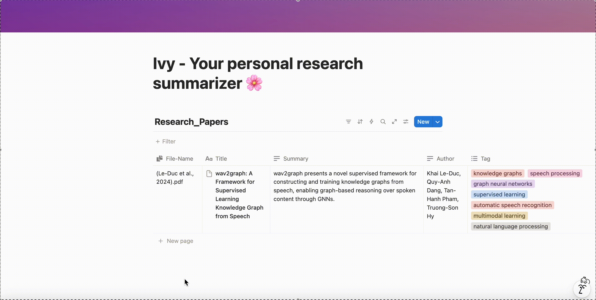

# 🌸 Ivy Research Assistant — Setup Guide

Your personal AI-powered paper summarizer that syncs with **Notion** 🧠✨  
Just drop your research PDFs, and Ivy will read, summarize, and organize them beautifully.

---

## Pre-Requisite:
Your setting shall include these:

A Notion Account

An IDE on your localmachine (as **Visual Studio Code**) - other IDE is ok

Python-Interpreter (>= Python 3.9 is ok)


## 🪴 Step-by-Step Setup

### **🩵 Step 1. Download & Unzip**
Download the `Ivy` package you received or (using the github cloning command)
```
   git clone [Ivy-github-link]
```

---

### **📘 Step 2. Duplicate the Notion Template**
Open this link:  
👉 [**Reading Paper Summarizing Tool Template**](https://dattrantienhust.notion.site/reading-paper-summarizing-tool)

Click **“Duplicate”** in the top right corner to add it to your own Notion workspace.

For detail instruction on how to **Duplicate a public page** check [**here**](https://www.notion.com/help/duplicate-public-pages)

---

### **🧭 Step 3. Find Your `NOTION_DATABASE_ID`**
1. Open your duplicated Notion database.  
2. Copy the full link (it looks like `https://www.notion.so/username/...<database_id>?v=...`) by follow the below interaction 

3. The **long string** before `?v=` is your **Database ID**.  
   Example:  
   ```
   28bf910aea75801e8490d58e80bb8a32
   ```

---

### **🔑 Step 4. Create Your Own Notion API Key**
1. Visit: [https://www.notion.so/my-integrations](https://www.notion.so/my-integrations)  
2. Click **+ New Integration**  
3. Give it a name (e.g., “Ivy Assistant”)  
4. Select your **Associated workspace**
5. Select yout **Type** (**Internal** for personal usage)
6. Adding your **Logo** if you want
4. Copy your **Internal Integration Token** — that’s your **NOTION_API_KEY**  
5. Share your duplicated Notion Page with your integration:

**You can follow the below instruction for step 4**


---

### **🧬 Step 5. Get Your Fireworks API Key**
1. Go to [https://fireworks.ai](https://fireworks.ai)  
2. Log in (free signup available)  
3. Copy your API Key → this will be your **FIREWORK_API_KEY**

Additional Notice:
1. For all the new account created with Fireworks - you shall **recieve free 1$ of inference credit** (without the need of parsing the banking information)
2. Ivy was using the **OpenAI gpt-oss-20b** with the price-tier as the following:
   - 0.07$ / 1 Million input tokens
   - 0.30$ / 1 Million output tokens

3. For better performance & personalized experience you can personally select the model on the Fireworks
---

### **📂 Step 6. Select the LLM Model**
1. Go to https://app.fireworks.ai/models
2. Select **Model Library** from the sidebar
3. In the main-console select LLM - Large language model that use to engine the Ivy
4. Copy the string contain the model's name with the format - this string will be your **MODEL_NAME**
```
accounts/fireworks/models/[model-name]
```
**You can follow the instruction as the below figure**


---

### **📂 Step 7. Configure Your `.env` File**
Open the `.env` file in the Ivy folder and fill in your variable :

**FOLDER_NAME** shall be the place you include your .pdf file for reading (include 1 pdf in here for demonstration) - default: **"./Research_Papers"**

**MARKITDOWN_URL** shall be the url for the server running the text-extraction from the pdf - no need to intervene or modify

```env
NOTION_API_KEY=your_notion_key_here_from_step_4
NOTION_DATABASE_ID=your_database_id_from_step_3
FOLDER_NAME="./Research_Papers" 
MARKITDOWN_URL=http://localhost:6000/extract
FIREWORK_API_KEY=fireworks_api_from_step_5
MODEL_NAME=model_name_from_step_6
```

---
### **💥 Step 8. Run your Ivy Program**

There are 2 ways that you can run Ivy by using the **script file (run_ivy.sh)** or using the **Python file (run_ivy.py)**
1. For running with the **run_ivy.sh** (with Linus/ MacOS):
   - navigate to the folder contain your **run_ivy.sh**
   - typing this to the terminal (make the file be executable)
   ```
      chmod +x run_ivy.sh
   ```
   - run the script by typing:
   ```
      ./run_ivy.sh
   ```
2. For running with the **run_ivy.py**
   - typing this to the terminal (make sure that you already have >= Python 3.9 on your current-project)
   ```
      python run_ivy.py
   ```
Note:
   
   **First-time running the application shall need to setup the enviroment - so the initalization shall be take 1-2 minitures - but from the second-time you reactivated the Ivy - the execution will be faster**